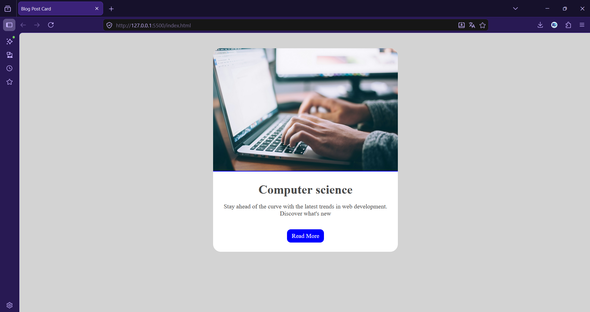

# Blog Post Card

Exercice CSS consistant à créer une carte d'article de blog stylisée avec image, titre, extrait et bouton d'appel à l'action.

---

 

---

## Capture d'écran

---

## Technologies

 

---

## Ce que j'ai appris

- **Arrière-plans et bordures CSS** - comment utiliser `border-radius` avec `overflow: hidden` pour découper proprement une image dans un conteneur arrondi, et appliquer une bordure décorative sur une image.
- **Accessibilité des contrastes** - choisir une couleur de texte (`#4a4a4a`) qui respecte les recommandations WCAG plutôt qu'un gris trop clair, et enrichir un lien ambigu avec `aria-label` pour les lecteurs d'écran.
- **Sémantique HTML** - remplacer un `
` générique par `<article>` pour donner du sens au contenu, et respecter la hiérarchie des titres en commençant par `<h1>`.

---

*Réalisé par **DocariDR***